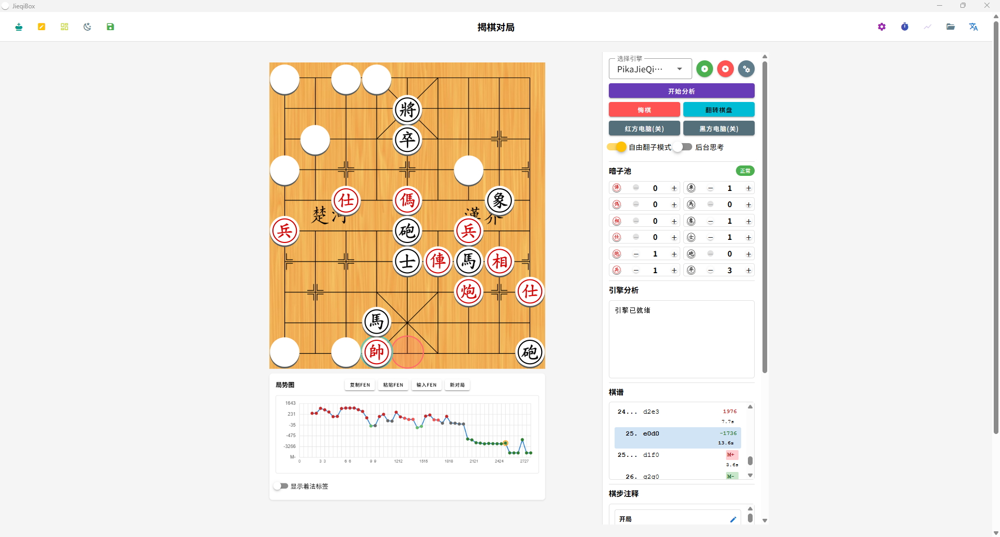
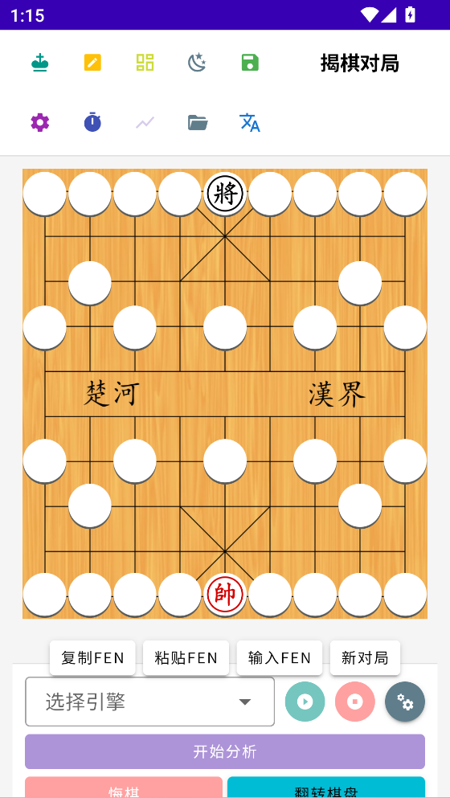
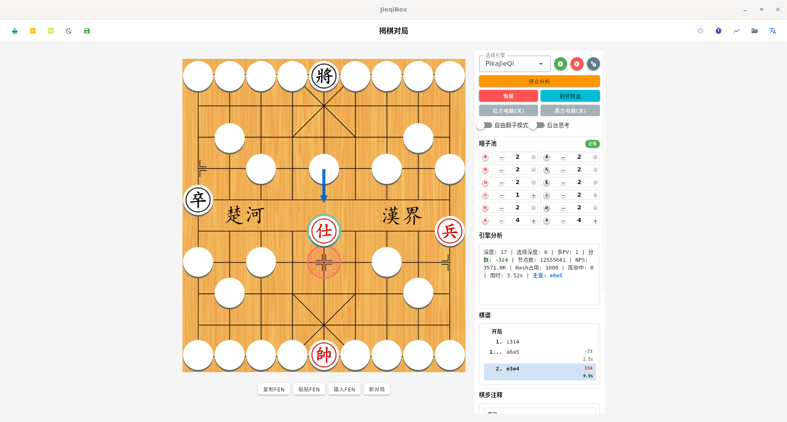

# JieqiBox


[](https://github.com/Velithia/JieqiBox/)
[](https://opensource.org/licenses/MIT)
[](https://discord.gg/d8HxM5Erad)

**JieqiBox** is a cross-platform desktop application (with partial Android support) for playing and analysing Jieqi (揭棋).  
Built with Tauri and Vue 3, it aims to be a lightweight yet capable companion for casual players and engine developers alike.

You can compile a supporting engine from the official Pikafish repository at <https://github.com/official-pikafish/Pikafish/tree/jieqi> or <https://github.com/official-pikafish/Pikafish/tree/jieqi_old>.

| Platform | Screenshot                                                                          |
| -------- | ----------------------------------------------------------------------------------- |
| Windows  |           |
| Android  |  |
| Linux    |       |

---

## Anime mascot (Reva)

Meet Reva-chan, the official mascot for JieqiBox~ We hope she makes your journey with Jieqi more fun.


---

## Features

- Interactive board with full rule enforcement
- Real-time engine analysis (Pikafish UCI protocol)
- Import / export positions in FEN (compatible with Pikafish)
- Visual board editor and complete move history
- Clean, responsive interface (Vuetify 3)
- Built-in localisation (简体中文, 繁體中文, English, Tiếng Việt, 日本語)

---

## Technology

| Layer     | Tools & Libraries                         |
| --------- | ----------------------------------------- |
| Core      | [Tauri](https://tauri.app/) (Rust)        |
| Front end | [Vue 3](https://vuejs.org/) + TypeScript  |
| UI        | [Vuetify 3](https://vuetifyjs.com/)       |
| Build     | [Vite](https://vitejs.dev/)               |
| Styling   | [SCSS](https://sass-lang.com/)            |
| i18n      | [Vue I18n](https://vue-i18n.intlify.dev/) |

---

## Quick Install

1. Visit the [releases page](https://github.com/Velithia/JieqiBox/releases).
2. Download the package for your system (`.msi`, `.dmg`, `.AppImage`, ...).
3. Run the installer and start playing.

---

## Building from Source

### Prerequisites

- Node.js and npm (or Yarn)
- Rust toolchain (see Tauri’s official [setup guide](https://tauri.app/v1/guides/getting-started/prerequisites/))

### Steps

```bash
git clone https://github.com/Velithia/JieqiBox.git
cd JieqiBox

# install dependencies
npm install        # or: yarn install

# start in development mode with hot reload
npm run tauri dev
```

### Production Build

```bash
npm run tauri build
```

Artifacts are written to `src-tauri/target/release/bundle/`.

---

## Contributing

Bug reports, feature ideas and pull requests are welcome.
Open an issue to start the conversation.

---

## License

Distributed under the MIT License. See the [LICENSE](./LICENSE) file for full text.
